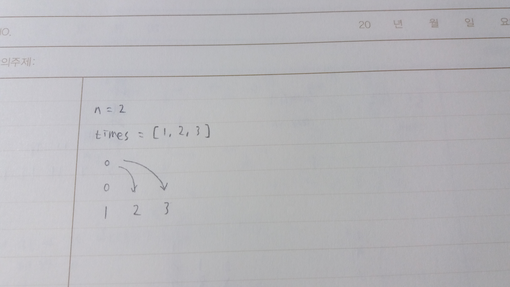
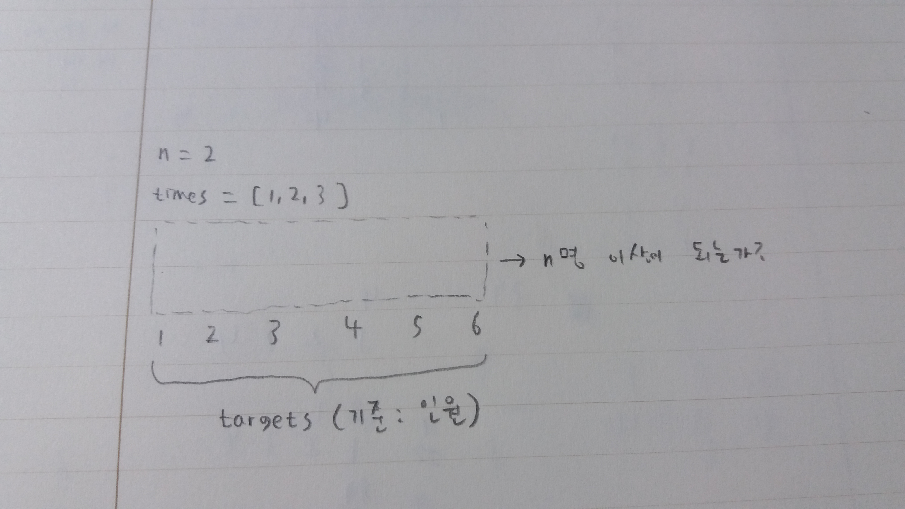
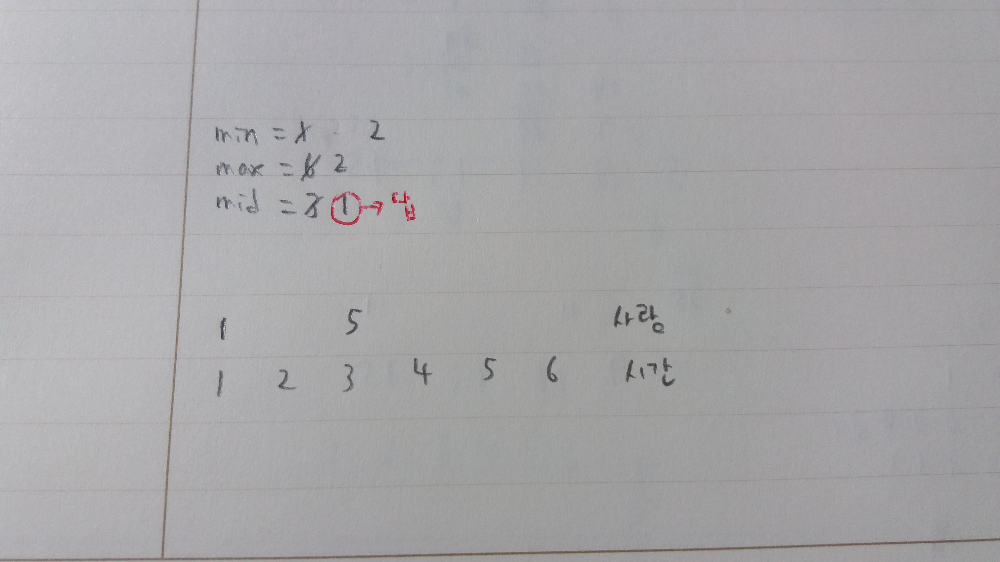

# Programmers Level 3 : 입국심사

> 꽤 어려웠던 문제... 이분 탐색 문제라는 걸 알았기에 풀이를 떠올릴 수 있었다. 만약 이분 탐색인 걸 몰랐다면 절대 내 힘으로 못 풀었을 거 같다 -_-;;;

 

{: width="500px" height="300px"}

처음에 생각했던 풀이는 이렇게 **가장 작은 시간에 사람을 모두 배정**한 다음, **전체 소요 시간이 최소가 되도록 다음 수들에게 차례차례 사람들을 분배**하는 것이다. 근데 이러면 수를 비교하는 과정에서 이중 for문을 사용해야 해서 시간복잡도가 **O(n^2)**이 된다.

이 문제는 케이스가 10억인 문제라 O(n)도 버겁기에 이 방법은 절대 쓸 수가 없다... 😥

 

{: width="500px" height="300px"}

그래서 이 문제는 이분 탐색으로 풀어야 한다. 이분 탐색을 알고 있었음에도 불구하고, 이 문제에 맞게 알고리즘을 구현하는 것은 쉽지 않았다. **첫 번째로 타켓을 정해야 했고, 두 번째로 탐색 조건을 설정해야 했는데, 각각 어떤 것으로 해야할 지 바로 정하기가 힘들었기 때문이다.**

많은 고민 끝에 만든 방법은 이것이다. 시간을 타겟으로 삼는다. 이 때 시간의 범위는 **최소 시간 ~ 최대 시간 \* 인원 수**가 된다. 이분 탐색을 하기 위해서는 모든 가능한 시간 중에서 원하는 시간을 찾아야 하기 때문이다.

탐색 기준은 인원을 삼는다. **시간이 얼마가 되든 수용해야 하는 인원은 n명으로 정해져 있다.** 그렇다면 탐색을 해서 시간을 찾아낼 때마다, 그 시간이 n명 이상의 인원을 수용할 수 있는지 체크해야 할 것이다.

 

{: width="500px" height="300px"}

n명 이상이 되면 더 작은 시간에서도 가능한지 체크해보아야 하기에 중간점으로부터 왼쪽 범위로 이동을 해서 탐색을 한다. n명 이상이 되지 않으면 시간이 지금보다 더 커야하므로, 중간점으로부터 오른쪽 범위로 이동을 해서 탐색을 한다. 이렇게 해서 최종적으로 도출되는 최소 시간이 정답이 된다.

이분 탐색을 할 때의 주의할 점은, **중간점과 비교할 값이 필요하다는 것이다.** 이분 탐색 과정에서 비교 없이 무조건 중간점만 맹신할 경우, **실제 나올 수 있는 최소 시간보다 더 큰 수가 정답으로 반환되거나 아예 오답이 반환될 수 있기 때문이다.** 내 코드에서는 변수 **compare**를 이용해서 현재의 시간과 중간점을 비교하면서 정답을 도출해나갔다.